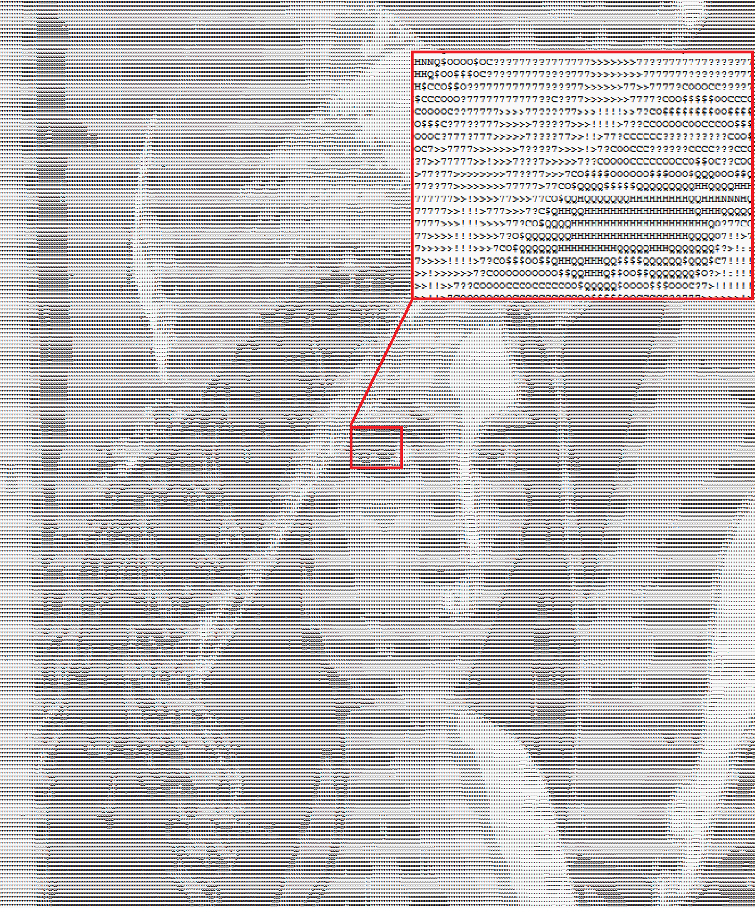

# 图像转换成ASCII码样式

将图像转换为ASCII字符组成的艺术风格，并保存到文本文件中。

## 描述

脚本 `main.py` 读取图像，将其转换为灰度图像，调整大小，然后将像素值映射到ASCII字符，以创建图像的ASCII艺术表示。生成的ASCII艺术将保存到文本文件中。

例如，以下图像：


被转换为 [assets/lenna.txt](assets/lenna.txt)，如下所示：



## 用法

1. **安装依赖**：确保已安装 `numpy` 和 `Pillow`。
    ```bash
    pip install numpy pillow
    ```

2. **准备图像**：将输入图像放在 `assets` 目录中，并在 `main.py` 中更新 `image_path` 变量为图像的路径。
   ```python
    image_path = "assets/your_image.png"
   ```

3. **运行脚本**：
    ```bash
    python main.py
    ```

4. **查看输出**：ASCII艺术将保存到与输入图像同名但扩展名为 `.txt` 的文本文件中。

## 配置

- `image_path`: 输入图像的路径。
- `output_path`: 保存输出文本文件的路径（根据输入图像名称自动生成）。
- `ascii_chars`: 从密到疏排序的ASCII字符字符串。
- `resized_height`: 输出高度 (行数)
- `aspect_ratio`: 字符的纵横比。

## 示例

如果您的输入图像是 `assets/lenna.png`，输出将保存为 `assets/lenna.txt`。

## 许可证

本项目基于 [MIT LICENSE](LICENSE) 授权，欢迎自由使用和修改。