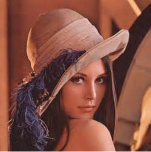
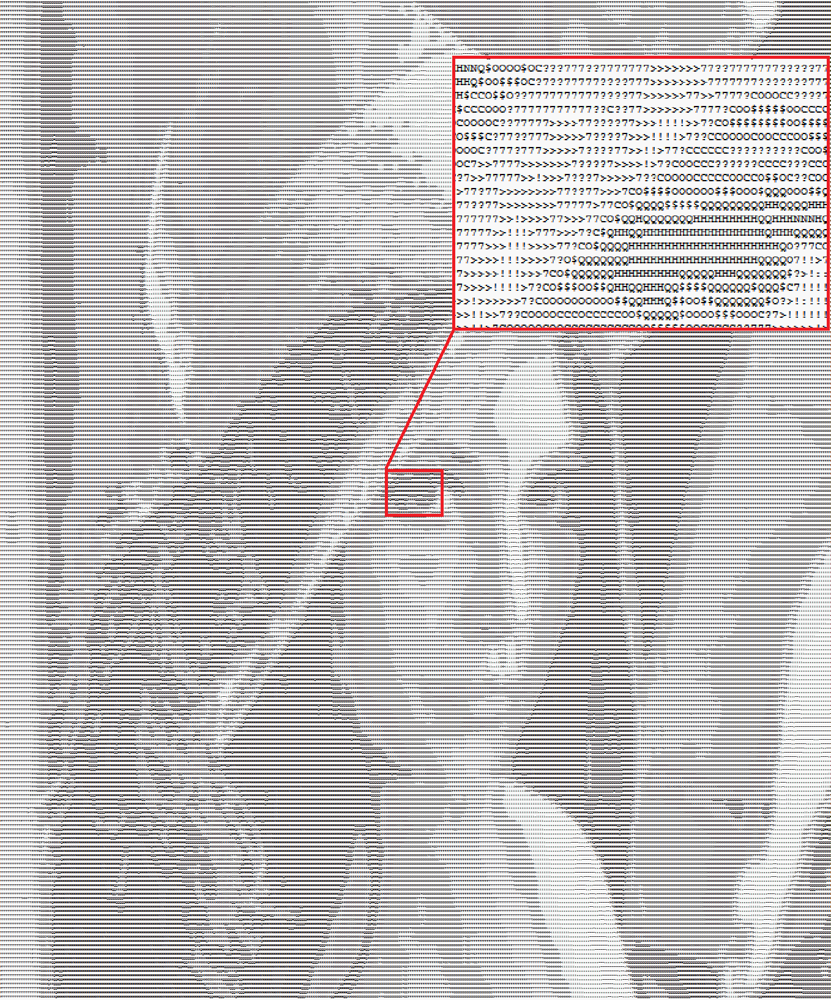

# Image to ASCII Art Converter

This project converts an image to ASCII characters art style and saves it to a text file.

## Description

The script `main.py` reads an image, converts it to grayscale, resizes it, and then maps the pixel values to ASCII characters to create an ASCII art representation of the image. The resulting ASCII art is saved to a text file.

For example, the following image:



is converted to [assets/lenna.txt](assets/lenna.txt), which looks like this:



## Quick Start

1. **Install dependencies**: Ensure you have `numpy` and `Pillow` installed.
    ```bash
    pip install numpy pillow
    ```

2. **Prepare your image**: Place your input image in the `assets` directory and update the `image_path` variable in `main.py` with the path to your image.
   ```python
    image_path = "assets/your_image.png"
   ```

3. **Run the script**:
    ```bash
    python main.py
    ```

4. **View the output**: The ASCII art will be saved in a text file with the same name as the input image but with a `.txt` extension.

## Configuration

- `image_path`: Path to the input image.
- `output_path`: Path to save the output text file (automatically generated based on the input image name).
- `ascii_chars`: String of ASCII characters sorted from dense to sparse.
- `resized_height`: Output height (lines)
- `aspect_ratio`: Aspect ratio of characters (height / width).

## Example

If your input image is `assets/lenna.png`, the output will be saved as `assets/lenna.txt`.

## License

This project is licensed under the [MIT LICENSE](LICENSE) - feel free to use and modify.